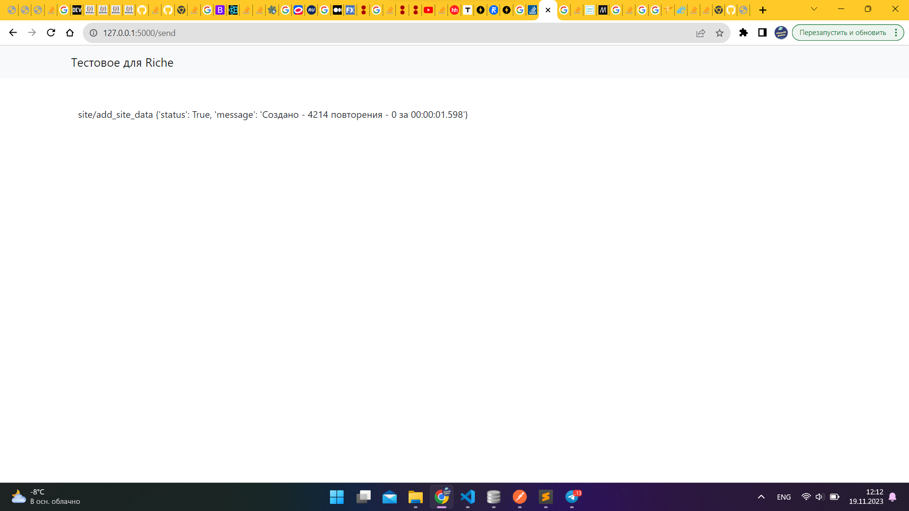

Для установки требуется использовать команду pip install -r requirements.txt.
Для запуска проекта достаточно использовать комманду python app.py
После в консоли мы получаем адрес по которому можем открыть страницу. автоматически при открытии страницы идет парсинг данных и при нажатии на кнопку отправляются два пост запроса на указанные вами адреса. так же я добавил ссылку нажав на которую мы выполняем вторую часть задания с пагинацией. страница может долго грузится из за объема данных поэтому я добавил сюда картинку что бы вы убедились что функция рабочая
